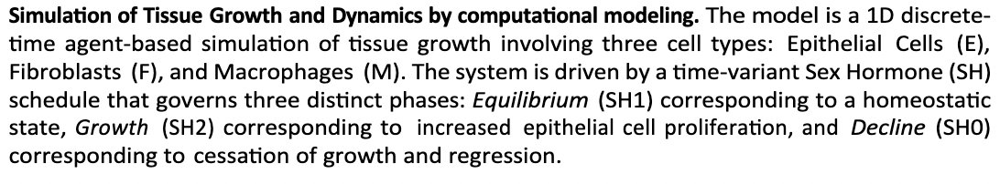
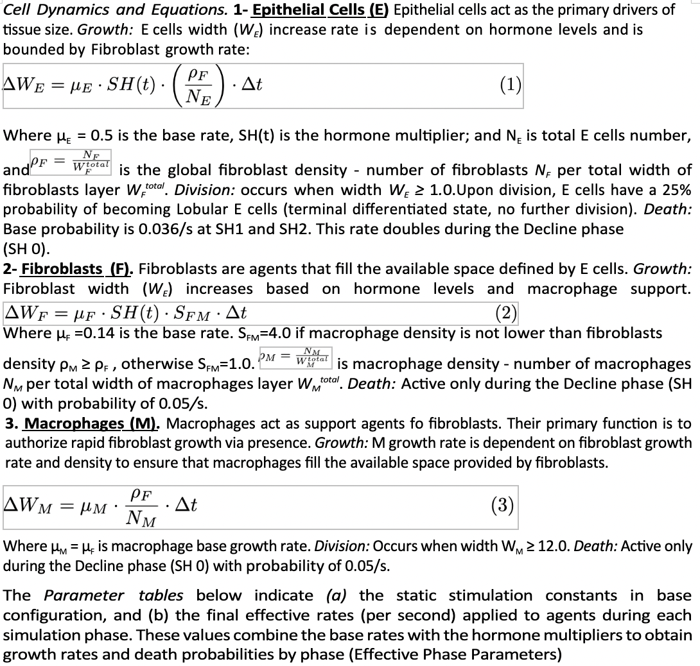
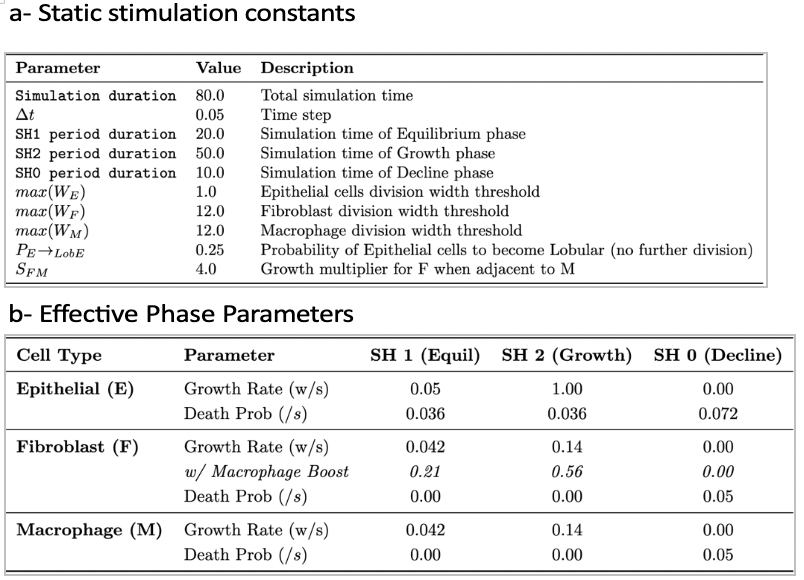

File tree as of January 29th 2026
```
release_package
├── README.md
├── grapher_v3.py
├── Makefile
├── massrunner.sh
├── simulation.py
├── table_exporter.py
├── visualization.py
└── visualize_graph.py

1 directory, 9 files
```

# Description

Below is the excerpt from the paper describing the structure of the model:







# Usage

To run simulations, use `simulation.py`, `visualization.py`, and `visualize_graph.py`. `simulation.py` preforms the full simulation start to finish, and exports the timeline to `.json` files. To view the `.json` files use the visualization scripts. The visualization scripts only visualize and don't simulate anything.

```sh
python3 simulation.py # interactive, will create similar to simulation_data_E30_F3_M3.json
# python3 simulation.py --default # will run with default m=3 f=3 e=30 settings
python3 simulation.py --m=0 # runs with 0 macrophages, will create simulation_data_E30_F3_M0.json file
# to generate graphs, run one or multiple simulation file through visualize_graph.py
python3 visualize_graph.py simulation_data_E30_F3_M3.json simulation_data_E30_F3_M0.json
# to create video, similarly run (beware the reendering is slow)
python3 visualization.py simulation_data_E30_F3_M3.json simulation_data_E30_F3_M0.json
```

Alternatively, look at `Makefile` and run preset scripts with `make <command>` like `make doublegraph`

`simulation.py` has arguments:
```
-h, --help     show this help message
--e E          Initial Epithelial cells (default: 30)
--lobec LOBEC  Proportion of LobEC cells (default: 0.5)
--f F          Initial Fibroblasts (default: 3)
--m M          Initial Macrophages (default: 3)
--default      Run default configuration (no interactive)
--seed SEED    set a specific seed
```

`visualization.py` has arguments:
```
--release             Render at full FPS. Default is fast preview (low FPS).
--gif                 Output a GIF file.
--speedup             Speed up final video playback by 1.5x.
```
Note that because reendering video is magnitudes slower than performing the simulations, by default only every 5th simulation step will be reendered. For a smoother simulation use `--release`. `--speedup` produces a faster video, it has no effect on the actual simulation.

To create a graph of the average of multiple simulations, use `table_exporter.py` and `grapher_v3.py`.

`table_exporter.py` will convert the json files to `.csv`s with time and cell count columns.

```sh
python3 table_exporter.py simulation_data_E30_F3_M3.json simulation_data_E30_F3_M0.json
```

`bash massrunner.sh` will simulate, convert to csv, and create a large number of simulations to be graphed. (Warning: it will flood the current directory with a large number of files.)

Then `grapher_v3.py` can graph their average and produce a `.svg` file containing the graph. However because `grapher_v3.py` is expected to be used on a large number of files at once, it doesn't accept the `.csv` files as arguments, and rather scans the derectories for `*_seed*.csv` wildcard marching files specifically. The text marched by the first star will be used to group the gaphs into `M0` and `M3` categories. Due to this complexity, `grapher_v3.py` best ran after `massrunner.sh`.

```sh
python3 grapher_v3.py
```